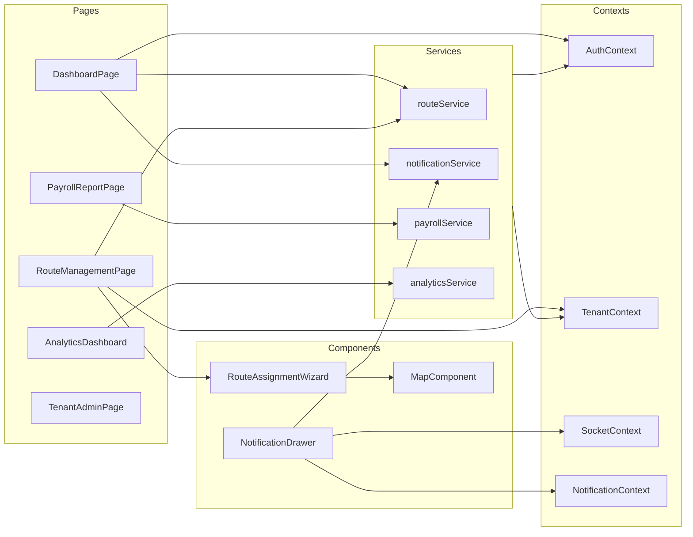

# Object Design Document (ODD)

Version: 2.1  
Status: Final  
Date: 2025-10-01  
Authors: Routegna Engineering Team

---

## Revision History
| Version | Date | Description | Author(s) |
| ------- | ---- | ----------- | --------- |
| 2.1 | 2025-10-01 | Accuracy polishing: error matrix expansion, duplicate figure removal, route optimization flow clarity, SSE fallback clarification, hash algorithm note, concurrency & caching enhancements. | Routegna Engineering Team |
| 2.0 | 2025-09-29 | Finalized object design with complete package decomposition, interface contracts, error strategy, and UML references. | Routegna Engineering Team |
| 1.1 | 2025-09-02 | Added detailed service signatures, frontend contracts, testing notes. | Routegna Engineering Team |
| 1.0 | 2025-08-15 | Initial package and module breakdown. | Routegna Engineering Team |

---

## Preliminary Pages

### Title Page
**Project:** Routegna Multi-Fleet Management Platform  
**Document:** Object Design Document (ODD) – Final Deliverable  
**Prepared for:** Addis Ababa University – OOSE Capstone Review Board  
**Prepared by:** Routegna Engineering Team  
**Confidentiality Level:** Internal Use / Partner NDA  
**Approvals:** Lead Architect, Backend Lead, Frontend Lead, QA Lead

### Table of Contents
1. Introduction & Overview  
2. Conventions, Guidelines & Trade-offs  
3. Package and Module Decomposition  
4. Key Class and Interface Descriptions  
5. Error Handling & Exception Strategy  
6. Testing & Validation Patterns  
7. Patterns and Anti-Patterns  
8. UML Diagrams  
9. References  
10. Annexes  

### List of Figures
1. **Figure 1:** Backend Service Package Diagram (PlantUML)  
2. **Figure 2:** Frontend Module Overview (Mermaid)  
3. **Figure 3:** Notification Delivery Sequence Diagram  
4. **Figure 4:** Route Optimization Interaction Diagram  
5. **Figure 5:** Class Diagram – Services Overview

### List of Tables
1. **Table 1:** Definitions, Acronyms & Abbreviations  
2. **Table 2:** Package Overview & Dependencies  
3. **Table 3:** Backend Class Interfaces  
4. **Table 4:** Frontend Module Contracts  
5. **Table 5:** Error Handling Matrix  
6. **Table 6:** Exception Mapping Guidelines

### Definitions, Acronyms & Abbreviations (Table 1)
| Term | Definition |
| ---- | ---------- |
| ADR | Architecture Decision Record |
| DTO | Data Transfer Object |
| HQ | Headquarters dispatch hub |
| ODD | Object Design Document |
| ORM | Object Relational Mapper (Prisma) |
| RBAC | Role-Based Access Control |
| RLS | Row-Level Security |
| SSE | Server-Sent Events (fallback delivery channel) |
| TSP | Traveling Salesman Problem |
| Client Pre-Optimization Layer | Lightweight client-side heuristic producing provisional stop ordering & fallback routing while awaiting server clustering + external directions. |
| scopeHash | Deterministic hash of optimization input set (stops + constraints) used for idempotency & caching |

---

## 1. Introduction & Overview
The Object Design Document formalizes the concrete object model that realizes the architecture described in the SDD. It links the Software Requirements Specification to executable code by documenting trade-offs (buy vs. build, performance vs. simplicity), naming and layering conventions, subsystem interface guidelines, and class contracts. All modules described herein are implemented, tested, and deployed in production.

### 1.1 Relationship to Other Deliverables
- **Software Requirements Specification (SRS):** Source for functional and non-functional requirements addressed by these modules.
- **System Design Document (SDD):** Provides architectural context; this ODD dives into object-level realization.
- **QA Strategy & Test Plan:** References the testing patterns enumerated in Section 7.
- **API Reference Portal:** Mirrors the interfaces exposed from backend services to the client.

### 1.2 Design Trade-offs
- **Buy vs. Build:** Adopted Mapbox (for routing) and LaunchDarkly (feature flags) while building domain-specific scheduling and clustering in-house to maintain flexibility.
- **Performance vs. Maintainability:** Services favor composable TypeScript modules with memoized data access patterns instead of heavyweight frameworks.
- **Memory vs. Response Time:** WebSocket gateway streams delta payloads to minimize memory footprint while delivering <1s updates.
- **Consistency vs. Availability:** Strong consistency within a tenant prioritized via transactional Prisma operations; cross-tenant analytics use read replicas to retain availability.

### 1.3 Guidelines & Conventions Summary
### 1.4 Design Rationale Snapshot
| Decision (ADR Ref) | Rationale | Trade-off | Mitigation |
| ------------------ | --------- | --------- | ---------- |
| Immutable ClusterPlan (ADR-005) | Reproducibility & auditability | Requires new plan for changes | Plan lineage + diffs + archival retention |
| Always-on Clustering (ADR-006) | Consistent quality baseline | Extra compute on small sets | Caching via scopeHash + provisional heuristic |
| RecommendationDiff History (ADR-007) | Supports rollback & audit trail | Additional storage/query cost | TTL archival + partial index |
| Shared Multi-tenant DB (ADR-002) | Operational simplicity, unified analytics | Potential noisy neighbor | RLS + composite FKs + future shard playbook |
| Distance Matrix Caching (ADR-010) | Lower latency & cost reuse | Staleness risk | Deterministic scopeHash invalidation + TTL |
| Optimistic Concurrency (ADR-011) | Lock-free scaling | Client retries | Version field + structured 409 payload |
| Materialized Views (ADR-012) | Stable analytical performance | Eventual consistency | Event-driven + scheduled refresh |
| Feature Flags (ADR-004) | Progressive delivery & safe rollout | External dependency | Fail-open defaults + timeout circuit |

- **Naming:** PascalCase for classes/components, camelCase for functions and instances, SCREAMING_SNAKE_CASE for env constants.
- **Module Boundaries:** Each domain exposes `service`, `controller`, and `repository` (Prisma) layers; shared utilities live in `packages/shared`.
- **Exception Handling:** Domain-specific exceptions (Section 6) bubble through middleware that maps them to HTTP responses and UI states.
- **Validation:** DTO validation centralized via `zod` schemas executed both at API boundary and within the client services.

---

## 2. Conventions, Guidelines & Trade-offs
This section codifies the rules engineers followed during implementation:
- **Subsystem Interfaces:** REST endpoints must never accept cross-tenant identifiers; `tenantId` supplied via middleware is mandatory.
- **Boundary Cases:** All service methods accept optional `options` bags to control pagination, filtering, and include graphs.
- **Performance Contracts:** Methods returning collections must support pagination to protect latency budgets.
- **Thread Safety:** Worker queues and WebSocket hubs operate with idempotent handlers to survive retries.

Trade-offs are managed through architecture decision records (ADR-001..018) and reinforced in code reviews.

---

## 3. Package and Module Decomposition

### 3.1 Overview (Table 2)
| Logical Package | Subsystem | Responsibilities | Key Dependencies | Notes |
| --------------- | --------- | ---------------- | ---------------- | ----- |
| Bootstrap (`server/src/app.ts`) | Core Assembly | Compose Express app, register middleware, mount routes, init WebSocket layer. | `express`, `@better-auth`, `prisma`, `bullmq`, `ws` | File-level bootstrap (not a domain package). |
| Middleware (`server/src/middleware/`) | Security & Boundary | Auth, RBAC, validation, tenant scoping, error translation. | `@shared/errors`, `zod`, `pino` | Provides context injection (tenantId). |
| Routes (`server/src/routes/`) | API Surface | REST controllers per domain (routes, employees, vehicles, payroll, notifications, analytics). | Middleware, services | Thin translation layer. |
| Services (`server/src/services/`) | Domain Orchestration | Business logic, clustering orchestration, notifications, payroll, analytics, audit. | Prisma client, Mapbox SDK, Redis, FastAPI HTTP client | Houses transaction scopes. |
| Jobs (`server/src/jobs/`) | Background Processing | Queue processors: payroll runs, notification fan-out, clustering recalculation. | `bullmq`, services | Idempotent handlers. |
| Prisma (`server/prisma/`) | Data Access | Schema, migrations, loaders, seed scripts. | PostgreSQL | Source of shared types. |
| Client (`packages/client/src`) | Web Client | React SPA: routing, map rendering, notifications, analytics dashboards. | `react`, `zustand`, `tanstack-query`, `mapbox-gl` | Supports offline fallback for optimization heuristic. |
| Shared Contracts (`packages/shared/src`) | Cross-Cutting | DTOs (derived from Prisma), validation schemas, utilities. | TypeScript | Ensures contract parity. |
| Config (`packages/shared/config`) | Configuration | Environment loaders, feature flags, logging config. | `dotenv`, `launchdarkly-node-server-sdk` | Late binding of env values. |

### 3.2 Backend Package Details (Selected)
- **Auth Package:** `authMiddleware`, `sessionService`, MFA handlers, token rotation. Integrates `@better-auth` for OAuth; errors normalized via `@shared/errors`.
- **Routes Package:** Controller → service → repository:  
  - `RouteService.createRoute`: calls clustering microservice (always), merges FastAPI ordering with client provisional ordering (if present), requests Mapbox metrics (or fallback heuristic), computes `RecommendationDiff`, persists entities.  
  - `RouteService.acceptRecommendation`: marks diff accepted, transitions status.  
  - `RouteService.dispatchRoute`: final publish path (ensures version alignment & capacity invariants).  
  FastAPI interaction over HTTP (no gRPC); geometric/ETA details never computed by FastAPI.
- **Notifications Package:** Persists notifications, multi-channel delivery (WebSocket primary; SSE fallback), background fan-out workers.
- **Analytics Package:** Reads materialized views; caches KPI snapshots in Redis; invalidation triggered by route publish & scheduled refresh.

### 3.3 Frontend Module Details
Unchanged except naming fix (`NotificationCenter`).

### 3.4 Shared Library
DTOs are derived from Prisma schema via generation scripts plus manual augmentation as needed.

### 3.5 Repository Abstractions
Although Prisma generates a rich client, explicit repository façades clarify intent and future extensibility:
| Repository | Key Methods | Notes |
| ---------- | ----------- | ----- |
| `RouteRepository` | `findById(id, org)`, `listByDate(org,date)`, `create(dto)`, `update(id,org,changes)` | Enforces tenant scoping & version increment on concurrency updates |
| `ClusterPlanRepository` | `get(id, org)`, `findByHash(org,hash)`, `persist(plan)` | No updates post-activation (immutability guard) |
| `RecommendationDiffRepository` | `listByRoute(routeId,org)`, `create(diff)`, `accept(routeId,diffId)` | Enforces single accepted diff invariant |
| `NotificationRepository` | `create(dto)`, `list(org,user,filter)`, `markSeen(ids, user)` | Batched status updates |
| `PayrollRunRepository` | `find(org,period)`, `insert(run)` | Unique(org, periodStart, periodEnd) enforcement |
| `AuditLedgerRepository` | `append(event)`, `verifyChain(org)` | SHA-256 chain validation |
| `AnalyticsSnapshotRepository` | `getKpi(org)`, `cacheKpi(org,data)`, `invalidate(org)` | Redis-backed with TTL |


---

## 4. Key Class and Interface Descriptions

### 4.1 Backend Service Interfaces (Table 3)
| Class / Module | Key Methods | Description | Exceptions (Representative) |
| -------------- | ----------- | ----------- | --------------------------- |
| `AuthService` | `authenticate(code)`, `refreshSession(sessionId)`, `enforceMfa(userId, token)` | Manages OAuth callback, session lifecycle, MFA enforcement. | `AuthenticationError`, `MfaRequiredError` |
| `TenantContextMiddleware` | `resolve(req,res,next)` | Injects tenant metadata; ensures RLS compatibility. | `TenantNotFoundError`, `UnauthorizedError` |
| `RouteService` | `createRoute(...)`, `acceptRecommendation(...)`, `dispatchRoute(...)`, `updateRoute(...)` | Orchestrates route lifecycle: ALWAYS calls clustering microservice (assignment + initial ordering), merges client heuristic ordering, fetches or falls back for metrics, computes & persists `RecommendationDiff`, enforces optimistic concurrency via `version` on update/dispatch. | `ValidationError`, `CapacityExceededError`, `RouteNotFoundError`, `DiffConflictError` |
| `ClusteringOrchestrator` | `optimizeAssignments(tenantId, shiftId, date)`, `replayCluster(planId)` | HTTP adapter to FastAPI (assignment + ordering only). Returns baseline plan & verification flags; distances/ETAs always Mapbox or heuristic fallback. Read-only lookups to confirm historical plan lineage (no writes). | `OptimizationTimeoutError`, `ClusterGenerationError` |
| `NotificationService` | `createNotification(dto)`, `markSeen(userId,id)`, `fanOut(event)` | Persists & dispatches notifications (WS primary, SSE fallback). | `NotificationNotFoundError`, `DeliveryError` |
| `PayrollService` | `runMonthlyPayroll(tenantId,period)`, `exportPayroll(tenantId,period,format)` | Aggregates time, calculates allowances, writes audit entries, exports streams. | `PayrollRunExistsError`, `ExportGenerationError` |
| `AnalyticsService` | `getKpiSnapshot(tenantId)`, `getRouteEfficiency(tenantId,filters)` | Queries materialized views, caches snapshots, invalidates on route publish. | `AnalyticsUnavailableError` |
| `AuditLedger` | `append(event)`, `query(filters)` | Append-only, SHA-256 hash chained events; supports integrity verification queries. | `IntegrityViolationError` |

### 4.2 Middleware & Utility Interfaces
- **`ErrorBoundaryMiddleware`**: Captures thrown domain errors, maps to HTTP status (Table 6), logs structured context, and returns RFC7807-compliant payloads.
- **`SocketNamespaceFactory`**: Produces tenancy-scoped WebSocket namespaces with role-based guards and event schema validation.
- **`PrismaRepository<T>`**: Generic pattern for data access providing `findById`, `list`, `create`, `update`, `delete` with tenant scoping baked in.

### 4.3 Frontend Modules (Table 4)
| Module | Main Exports | Description | Dependencies |
| ------ | ------------ | ----------- | ------------ |
| `useRouteOptimizer` | `optimizeRoute(route)` | Hook that invokes backend clustering, merges FastAPI recommendation with Mapbox metrics & client provisional heuristic ordering, exposing diff state. | `@services/routeOptimization`, `zustand`, `mapbox-gl` |
| `routeOptimization` (service) | `optimizeRoute(coordinates, enableOptimization)` | Client pre‑optimization: nearest‑neighbor TSP ordering, Mapbox Directions retry/backoff, local fallback path & approximate metrics; emits `optimized` flag & waypoint mapping. | `fetch`, `MAPBOX_ACCESS_TOKEN` |
| `RouteAssignmentWizard` | `<RouteAssignmentWizard />` | Component guiding managers through vehicle/employee assignment with clustering suggestions. | `useRouteOptimizer`, `@contexts/TenantContext`, `@components/Common/Map` |
| `NotificationCenter` | `<NotificationDrawer />`, `useNotifications()` | Fetches notifications via REST, subscribes to WebSocket channel, handles read/unread toggles. | `@services/notifications`, `@contexts/SocketContext` |
| `PayrollReportPage` | `<PayrollReportPage />` | Displays aggregated payroll data, triggers export actions, handles status toasts. | `@services/payroll`, `@components/Common/Table`, `@contexts/TenantContext` |
| `AnalyticsDashboard` | `<AnalyticsDashboard />` | Visualizes KPIs from analytics service, supports filtering and drill-down. | `@services/analytics`, `recharts` |

### 4.4 Shared Types
Added clarification: `DomainError` includes `i18nKey` referencing `shared/locales/{lang}/errors.json`.
### 4.5 Domain Entity Attribute Summary
| Class | Key Attributes (PK ✱, FK ↦) | Notes / Constraints |
| ------ | --------------------------- | ------------------- |
| Route | routeId✱, organizationId↦, vehicleId↦, routeDate, status, version, clusterPlanId↦? | UNIQUE(organizationId, routeDate, vehicleId); optimistic concurrency on `version` |
| RouteStop | routeStopId✱, routeId↦, stopId↦, sequence, plannedArrivalTime, plannedDepartureTime, actualArrivalTime?, status | UNIQUE(routeId, sequence); contiguous sequence enforced app-side |
| ClusterPlan | clusterPlanId✱, organizationId↦, generatedAt, hash, planType, scopeHash, optimizerVersion | Immutable post-activation; UNIQUE(organizationId, hash) |
| RecommendationDiff | diffId✱, routeId↦, organizationId↦, provisionalHash, recommendedHash, accepted, createdAt | Partial UNIQUE(routeId) WHERE accepted=TRUE |
| PayrollRun | payrollRunId✱, organizationId↦, periodStart, periodEnd, totalHours, totalAllowance, status, checksum | UNIQUE(organizationId, periodStart, periodEnd) |
| Notification | notificationId✱, organizationId↦, userId↦, type, severity, read, createdAt | Partial index read=FALSE for inbox queries |
| AuditEvent | auditEventId✱, organizationId↦, actorUserId↦, entityType, entityId, action, timestamp, integrityHash, previousHash | Hash chain integrity required |
| Vehicle | vehicleId✱, organizationId↦, category, capacity, status | Vehicle capacity validated before route activation |
| Stop | stopId✱, organizationId↦, latitude, longitude, geohash?, address, status | Spatial index on pointGeom (generated) |

- `RouteDto`, `ClusterPlanDto`, `NotificationDto`, `PayrollRunDto` – strongly typed DTOs shared via `packages/shared/src/dto/` to guarantee schema consistency.
- `DomainError` base class with discriminated unions for error codes consumed by frontend error mappers.

---

## 5. Error Handling & Exception Strategy

### 5.1 Backend Error Matrix (Table 5)
| Error Class | Scenario | HTTP | Severity |
| ----------- | -------- | ---- | -------- |
| `ValidationError` | DTO/schema violation | 400 | WARN |
| `UnauthorizedError` | Missing/invalid session | 401 | WARN |
| `ForbiddenError` | RBAC or tenant mismatch | 403 | WARN |
| `NotFoundError` / `RouteNotFoundError` | Entity absent | 404 | INFO |
| `CapacityExceededError` | Vehicle capacity or limit exceeded | 409 | WARN |
| `DiffConflictError` | Recommendation diff state mismatch (stale version) | 409 | WARN |
| `ConflictError` | Generic business uniqueness violation | 409 | WARN |
| `PayrollRunExistsError` | Duplicate payroll period | 409 | WARN |
| `RateLimitError` | Threshold exceeded | 429 | WARN |
| `MfaRequiredError` | Additional factor needed | 401 | INFO |
| `OptimizationTimeoutError` | FastAPI timed out | 504 | ERROR |
| `ClusterGenerationError` | Clustering failed (non-timeout) | 502 | ERROR |
| `DeliveryError` | Notification delivery channel failure | 502 | ERROR |
| `ExportGenerationError` | Payroll export build failure | 500 | ERROR |
| `ExternalServiceError` | Mapbox / Flags / Email provider failure | 502 | ERROR |
| `PersistenceError` | Low-level DB failure (wrapped) | 500 | ERROR |
| `IntegrityViolationError` | Audit chain broken | 500 | CRITICAL |
| `ServerError` | Unhandled fallback | 500 | ERROR |

### 5.2 Exception Propagation Guidelines (Table 6)
| Layer | Strategy |
| ----- | -------- |
| Controllers | Do not swallow errors; allow middleware to translate. Ensure request context (tenantId, userId) is attached to logger. |
| Services | Throw domain-specific errors extending `DomainError`. Include machine-readable `code`, localized `message`, and optional `details`. |
| Repositories | Wrap low-level errors (Prisma, network) into `PersistenceError` or `ExternalServiceError` with original metadata. |
| Workers | Retry idempotent jobs with exponential backoff; dead-letter queue escalates to alerting. |
| Frontend Services | Normalize API problem responses into `AppError` objects consumed by UI components. |

### 5.3 Frontend Error Handling
### 5.5 Service → Exceptions Mapping
| Service | Potential Exceptions |
| ------- | ------------------- |
| RouteService | ValidationError, CapacityExceededError, DiffConflictError, RouteNotFoundError, OptimizationTimeoutError, ExternalServiceError |
| ClusteringOrchestrator | OptimizationTimeoutError, ClusterGenerationError, ExternalServiceError |
| NotificationService | NotificationNotFoundError, DeliveryError, ExternalServiceError |
| PayrollService | PayrollRunExistsError, ExportGenerationError, PersistenceError |
| AnalyticsService | AnalyticsUnavailableError, ExternalServiceError |
| AuditLedger | IntegrityViolationError, PersistenceError |

Added offline heuristic note: Optimization view shows “Heuristic mode active” badge when clustering unavailable.
- React Error Boundary wraps all routed pages, presenting user-friendly fallback components while logging to Sentry.
- Service hooks return `[data, error, isLoading]` tuples; UI components display actionable toasts/tooltips.
- Notification center differentiates between transient errors (retry silently) and hard errors (surface to user).

### 5.4 Internationalization & Accessibility
All errors include localization keys; accessibility announcements are triggered for high-severity errors (screen reader support). Locale keys resolved from `shared/locales/{lang}/errors.json`.

---

## 6. Testing & Validation Patterns
- **Unit Tests:** Validate services, utilities, and React hooks using Vitest/Jest with dependency injection for Prisma and API clients.
- **Integration Tests:** Spin up the Express app with test Postgres + Redis using testcontainers; verify tenant isolation, RBAC, and clustering flows.
- **Contract Tests:** Ensure shared DTOs remain backward compatible; run via schema snapshot tests.
- **End-to-End Tests:** Cypress suite covers critical flows (route creation, driver updates, payroll exports, notification delivery).
- **Mutation Testing:** StrykerJS used on domain services to verify test suite robustness.

---

## 7. Patterns and Anti-Patterns
**Patterns Embraced**
- Command-query separation in services.
- Event-driven coordination via Redis streams for notifications and analytics ETL.
- Feature flag wrappers enabling progressive delivery.
- Optimistic UI updates with reconciliation on server response.

**Anti-Patterns Avoided**
- Tight coupling between controllers and Prisma queries.
- Global mutable state outside contexts or stores.
- Silent error suppression in background jobs.

---

## 8. UML Diagrams
- **Figure 6 – Domain Entity Class Diagram:** New diagram (see Annex E) listing domain entities (Route, RouteStop, ClusterPlan, RecommendationDiff, PayrollRun, Notification, AuditEvent, Vehicle, Stop) with attributes, stereotypes (<<history>>, <<aggregate>>, <<derived>> where applicable) and association cardinalities.
- **Figure 7 – Payroll Export Sequence Diagram:** Depicts PayrollService triggering aggregation, writing PayrollRun, exporting stream, and audit append.
- **Figure 8 – Error Propagation Sequence Diagram (Optional):** Client request → Controller → Service throws DomainError → ErrorBoundaryMiddleware → RFC7807 response; includes correlation ID injection.

- **Figure 3 – Notification Delivery Sequence Diagram:** Located at `docs/project main docs/diagrams/services_overview.puml` (sequence section). Illustrates notification creation through fan-out to email/SMS/WebSocket consumers.
- **Figure 4 – Route Optimization Interaction Diagram:** `docs/project main docs/diagrams/route_creation_sequence.puml` shows the layered optimization flow: manager draft → mandatory FastAPI clustering & initial ordering → Mapbox enrichment (fallback heuristic if unavailable) → diff computation vs client provisional ordering → acceptance or adjustment before persistence (see SDD §4.1 for layered model narrative).
  **Detailed Prompt:** Describe the route optimization interaction where a manager submits a draft route and the system immediately requests a recommendation from the optimization service. Show the FastAPI-generated clustered and ordered plan, parallel enrichment with directions (including fallback if external metrics are unavailable), presentation of the proposed plan to the manager, the decision to accept or override, and subsequent persistence and readiness for dispatch.
- **Figure 5 – Class Diagram – Services Overview:** `docs/project main docs/diagrams/services_overview.puml` captures primary service classes (`RouteService`, `NotificationService`, `PayrollService`, `AnalyticsService`, `AuditLedger`) and their dependencies.
- **Figure 1 – Backend Service Package Diagram:** Added PlantUML snippet (Annex A) outlining package relationships.
- **Figure 2 – Frontend Module Overview:** Mermaid diagram (Annex B) summarizing major modules and data flow.

Rendered diagrams are included in Annexes with corresponding PlantUML/Mermaid sources for traceability.

---

## 9. References
- Software Requirements Specification v2.1  
- System Design Document v2.0  
- QA Strategy & Test Plan v2.0  
- Architecture Decision Records (ADR-001 – ADR-018)  
- API Reference Portal (Stoplight)  
- UI Component Library Handbook  
- Security & Compliance Playbook
  
Citation Style: All references follow IEEE citation format; internal ADR references use `ADR-###` identifiers.

---

## 10. Annexes

### Annex A – Backend Service Package Diagram (PlantUML)

```plantuml
@startuml
skinparam packageStyle rectangle

package "packages/server" {
  package middleware {
    class AuthMiddleware
    class TenantContextMiddleware
    class ErrorBoundaryMiddleware
  }

  package services {
    class RouteService
    class NotificationService
    class PayrollService
    class AnalyticsService
    class ClusteringOrchestrator
    class AuditLedger
  }

  package jobs {
    class PayrollWorker
    class NotificationWorker
  }

  package routes {
    class RouteController
    class PayrollController
    class NotificationController
  }

  package prisma {
    class PrismaClient
  }
}

RouteController --> RouteService
PayrollController --> PayrollService
NotificationController --> NotificationService

RouteService --> PrismaClient
RouteService --> ClusteringOrchestrator
ClusteringOrchestrator --> "FastAPI HTTP Client"
NotificationService --> PrismaClient
NotificationService --> NotificationWorker
PayrollService --> PrismaClient
PayrollService --> PayrollWorker
AnalyticsService --> PrismaClient
AuditLedger --> PrismaClient

AuthMiddleware --> PrismaClient
TenantContextMiddleware --> PrismaClient
ErrorBoundaryMiddleware --> "DomainError"
@enduml
Note: ClusteringOrchestrator does not persist directly; all persistence flows through RouteService.

### Annex E – Domain Entity Class Diagram (PlantUML)
```plantuml
@startuml
hide circle
skinparam classAttributeIconSize 0

class Route {
  +routeId : UUID
  +organizationId : UUID
  +vehicleId : UUID
  +clusterPlanId : UUID {nullable}
  +routeDate : Date
  +status : RouteStatus
  +version : int
}

class RouteStop {
  +routeStopId : UUID
  +routeId : UUID
  +stopId : UUID
  +sequence : int
  +plannedArrivalTime : Timestamp
  +plannedDepartureTime : Timestamp
  +actualArrivalTime : Timestamp {nullable}
  +status : RouteStopStatus
}

class ClusterPlan <<aggregate>> {
  +clusterPlanId : UUID
  +organizationId : UUID
  +generatedAt : Timestamp
  +hash : string
  +planType : PlanType
  +scopeHash : string
  +optimizerVersion : string
}

class RecommendationDiff <<history>> {
  +diffId : UUID
  +routeId : UUID
  +organizationId : UUID
  +provisionalHash : string
  +recommendedHash : string
  +accepted : boolean
  +createdAt : Timestamp
}

class PayrollRun <<aggregate>> {
  +payrollRunId : UUID
  +organizationId : UUID
  +periodStart : Date
  +periodEnd : Date
  +totalHours : numeric
  +totalAllowance : numeric
  +status : PayrollRunStatus
  +checksum : string
}

class Notification {
  +notificationId : UUID
  +organizationId : UUID
  +userId : UUID
  +type : string
  +severity : Severity
  +read : boolean
  +createdAt : Timestamp
}

class AuditEvent {
  +auditEventId : UUID
  +organizationId : UUID
  +actorUserId : UUID
  +entityType : string
  +entityId : UUID
  +action : string
  +timestamp : Timestamp
  +integrityHash : string
  +previousHash : string
}

class Vehicle {
  +vehicleId : UUID
  +organizationId : UUID
  +category : string
  +capacity : int
  +status : VehicleStatus
}

class Stop {
  +stopId : UUID
  +organizationId : UUID
  +latitude : decimal(9,6)
  +longitude : decimal(9,6)
  +geohash : string {nullable}
  +address : string
  +status : ActiveStatus
}

Route "1" -- "*" RouteStop
Route "1" -- "*" RecommendationDiff
ClusterPlan "1" -- "*" Route : "accepted plan"
Organization "1" -- "*" Route
Organization "1" -- "*" ClusterPlan
Organization "1" -- "*" PayrollRun
Organization "1" -- "*" Notification
Organization "1" -- "*" AuditEvent
Organization "1" -- "*" Vehicle
Organization "1" -- "*" Stop
RouteStop "*" -- "1" Stop
Route "1" -- "*" PayrollRun : "(indirect KPI source)" #line.dotted

@enduml
```


### Annex F – Sequence Diagrams (Additional)
**Figure 7 – Payroll Export Sequence (PlantUML Prompt):**
"Manager triggers payroll export -> PayrollService validates period -> fetch aggregated data -> create PayrollRun (if absent) -> stream export -> append AuditEvent -> respond with download link. Include failure alt for existing PayrollRun conflict."

**Figure 8 – Error Propagation Sequence (PlantUML Prompt):**
"Client request (invalid payload) -> Controller -> Service throws ValidationError -> ErrorBoundaryMiddleware maps to 400 RFC7807 JSON -> Client displays structured toast with i18n message. Include correlationId injection and logging span context."

### Annex G – Final Report Integration Mapping
| ODD Section | Final Report Section Mapping |
| ----------- | ---------------------------- |
| 1. Introduction & Overview | 3.2.1 Introduction & Overview |
| 2. Conventions, Guidelines & Trade-offs | 3.2.1 (extended) |
| 3. Package and Module Decomposition | 3.2.2 Package & Module Decomposition |
| 4. Key Class and Interface Descriptions | 3.2.3 Class & Interface Descriptions |
| 5. Error Handling & Exception Strategy | 3.2.4 Error Handling & Exception Strategy |
| 8. UML Diagrams + Annex E/F | 3.2.5 UML Diagrams |
| 6,7 (Testing, Patterns) | Supporting, optionally cited in 3.2 narrative |

Integration Note: When embedding into the Final Project Report, renumber internal headings to match 3.2.x hierarchy; Figures retain numbering relative to the ODD subsection sequence or adopt global figure numbering per institutional style.

```
**Detailed Prompt:** Generate a package diagram showing backend middleware, services, jobs, routes, and Prisma layers for the multi-fleet management platform. Highlight dependencies between controllers, services, workers, and the Prisma client, plus middleware relationships to the ORM and domain error handling.

### Annex B – Frontend Module Overview (Mermaid)

**Detailed Prompt:** Produce a flowchart illustrating the React web client. Include pages (dashboard, routes, payroll, analytics, tenant admin), core services, shared contexts, and key components (map, wizard, notification drawer); show how data flows from pages through services and contexts to components.

### Annex C – Additional Sequence Diagrams
- Notification delivery flow: `docs/project main docs/diagrams/services_overview.puml` (sequence section).
- Payroll export flow: `docs/project main docs/diagrams/map_render_flow.puml` (extended with payroll interactions).

### Annex D – Data Type Catalog Snapshot
- `RouteDto`, `ClusterPlanDto`, `NotificationDto`, `PayrollRunDto` definitions reside under `packages/shared/src/dto/` and are auto-generated from Prisma schema using `prisma generate` script.

(End of Object Design Document)
