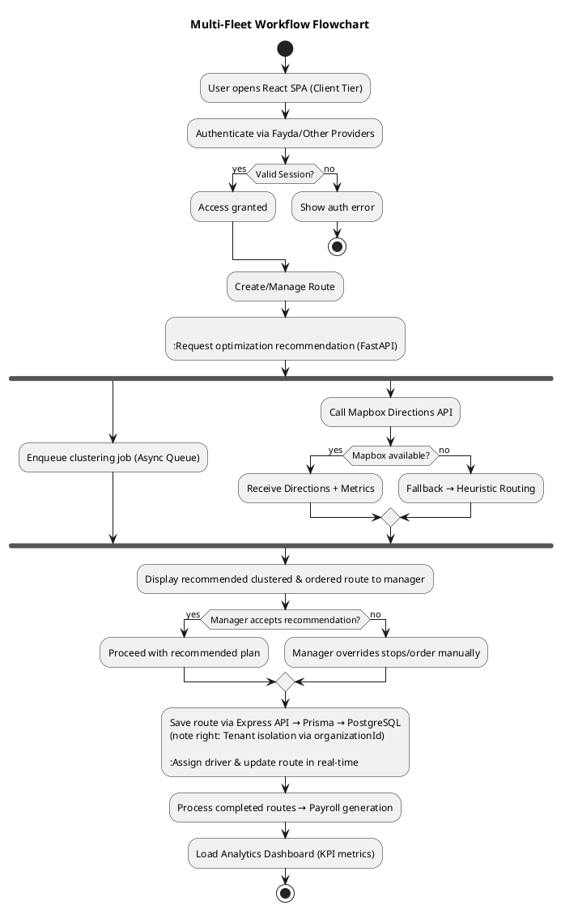
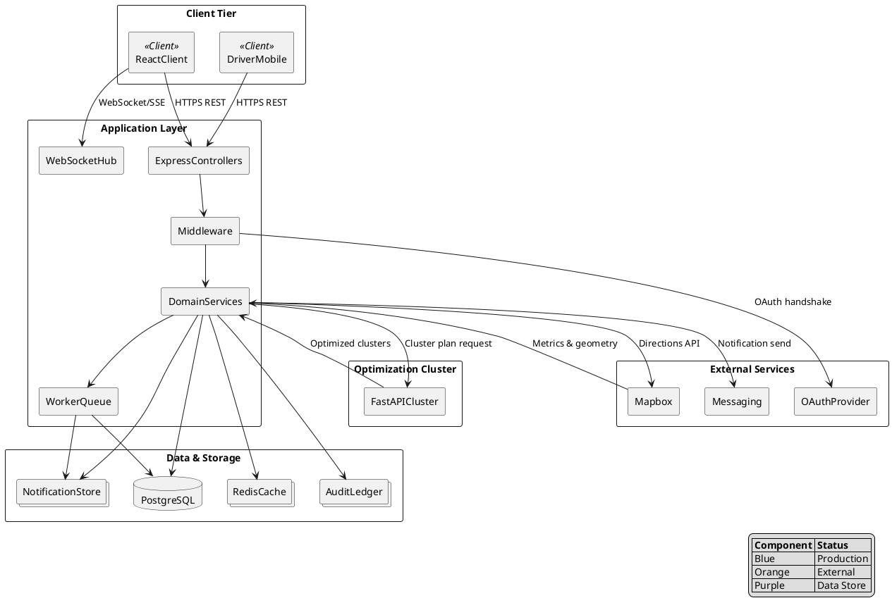
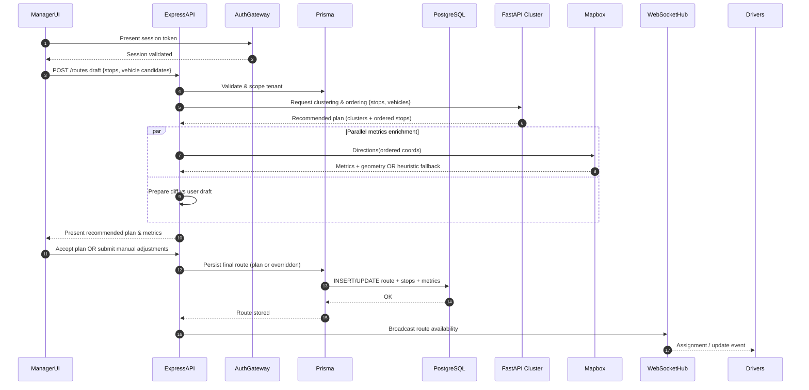

# System Design Document (SDD)

Version: 2.0  
Status: Final  
Date: 2025-09-29  
Authors: Routegna Engineering Team

---

## Revision History
| Version | Date | Description | Author(s) |
| ------- | ---- | ----------- | --------- |
| 2.0 | 2025-09-29 | Finalized implementation view with fully delivered capabilities, embedded diagrams, and complete traceability. | Routegna Engineering Team |
| 1.1 | 2025-09-02 | Expanded architecture depth, risk matrix, scalability, ops runbooks, env vars. | Routegna Engineering Team |
| 1.0 | 2025-09-02 | Initial formalization from codebase and docs. | Routegna Engineering Team |

---

## 1. Preliminary Pages

### 1.1 Title Page
**Project:** Routegna Multi-Fleet Management Platform  
**Document:** System Design Document (SDD) – Final Deliverable  
**Prepared for:** Addis Ababa University – OOSE Capstone Review Board  
**Prepared by:** Routegna Engineering Team  
**Confidentiality Level:** Internal Use / Partner NDA  
**Approvals:** Product Owner, Engineering Lead, Security Lead, QA Lead  

### 1.2 Table of Contents
1. Preliminary Pages  
2. Introduction & Overview  
3. Software Architecture  
4. Subsystem Decomposition  
5. Data Persistence & Multi-Tenancy  
6. Access Control, Security & Compliance  
| Extensibility | Feature modules pluggable without core rewrites. | New module integrated within a sprint without regression. |
| Operational Excellence | Continuous monitoring & automated recovery. | MTTR < 15 minutes; automated alerting on SLO breach. |
| Resilience | Graceful degradation against third-party failures. | No primary user flow blocked during Mapbox or auth outage. |


### 2.4 Stakeholders
| Role | Interest |
| ---- | -------- |
| Product Owner | Feature parity vs roadmap; KPI adherence |
| Backend Engineers | Service orchestration, data integrity |
| Frontend Engineers | API stability, state management |
| Security & Compliance | RBAC, MFA, audit, GDPR tooling |
| DevOps / SRE | Deployability, observability, runbooks |
| Finance & HR Admins | Payroll correctness, export formats |

### 2.5 Document Conventions
- Markdown format with tables for structured data.  
- Mermaid & PlantUML for diagrams (rendered in annexes).  
- RFC-2119 wording (`MUST`, `SHOULD`, `MAY`) applies to design mandates.

---

## 3. Software Architecture

### 3.1 Architectural Style
Layered micro-frontend + service architecture with clear boundaries:
```
Client (React SPA + real-time sockets)
  ↕ HTTPS REST + WebSocket/SSE
API Gateway (Express/TypeScript)
  ↕
Middleware (Auth, RBAC, Validation, Tenant Context)
  ↕
Domain Services (Routes, Payroll, Notifications, Analytics)
  ↕
Data Access (Prisma ORM)
  ↔ PostgreSQL (Tenant-partitioned schema)
External Services: Mapbox Directions, Fayda OAuth, Email/SMS provider
Prototype Graduated: FastAPI clustering (now production-hardened)
```

#### 3.1.1 Multi-Fleet Workflow Flowchart

**Detailed Prompt:** Depict the Routegna multi-fleet workflow from a user launching the React SPA and authenticating through betterAuth (including Fayda and other providers), branching on session validity with an error termination path. After authentication, always request an optimization recommendation from the FastAPI clustering service: show parallel branches where one enqueues the clustering job and the other calls Mapbox for directions, falling back to a heuristic if unavailable. Present the combined recommended clustered and ordered route to the manager and include a decision node where the manager can accept the recommendation or override stops/order manually. Continue with tenant‑isolated persistence via Express, Prisma, and PostgreSQL, then highlight real-time driver assignment updates, payroll generation from completed routes, and the final analytics dashboard review before process termination.

### 3.2 Component Views
**Table 2:**
| View | Focus | Highlights |
| ---- | ----- | ---------- |
| Logical | Domain modules and interactions | distinct bounded contexts |
| Development | Monorepo packages | `/packages/server`, `/packages/client`, `/packages/shared` |
| Process | Runtime processes and queues | API pods, WebSocket gateway, job workers |
| Deployment | Environments & scaling | Dev, Staging, Prod with auto-scaling |
| Data | Entities & relationships | tenantId scoping, audit trails |

### 3.3 Component Diagram (Figure 1 & Figure 2)

#### Figure 1 – Mermaid
```mermaid
flowchart LR
  subgraph Client[Client Tier]
    A[React SPA\\nState Machine]
    T[Driver Mobile View]
  end

  subgraph API[Application API Tier]
    B[Express Controllers]
    M[Middleware Suite\\n(Auth, Tenant, Validation)]
    D[Domain Services]
    WS[WebSocket/SSE Hub]
    Q[Background Workers]
  end

  subgraph Data[Persistence Tier]
    P[(PostgreSQL\\nRow-Level Security)]
    AU[(Audit Ledger)]
    NO[(Notification Store)]
    CA[(Cache - Redis)]
  end

  subgraph Prototype[Optimization Cluster]
    F[FastAPI Clustering Engine]
  end

  subgraph External[External Services]
    MAP[Mapbox Directions]
    AUTH[Fayda OAuth / Federated IdP]
    MAIL[Email/SMS Provider]
  end

  A -->|REST/GraphQL over HTTPS| B
  A -->|WebSocket| WS
  T -->|Mobile REST| B

  B --> M --> D --> P
  D --> NO
  D --> AU
  D --> CA

  D -->|Async Job| Q
  Q --> P
  Q --> NO

  D -->|Cluster Plan Request| F
  F -->|Optimized Route Bundle| D

  D -->|Directions Request| MAP
  MAP --> D

  M --> AUTH
  D --> MAIL

  classDef current fill=#e0f7fa,stroke=#006064,color=#00363a,stroke-width:2px;
  classDef datastore fill=#ede7f6,stroke=#5e35b1,color=#311b92;
  classDef external fill=#fff3e0,stroke=#ef6c00,color=#e65100;
  class A,T,B,M,D,WS,Q current;
  class P,AU,NO,CA datastore;
  class F,MAP,AUTH,MAIL external;
```

**Detailed Prompt:** Create a flowchart that maps the production Routegna platform across client, API, data, optimization, and external tiers. Include labeled nodes for React SPA, driver mobile app, Express controllers, middleware, domain services, WebSocket hub, background workers, PostgreSQL with RLS, audit ledger, notification store, Redis cache, FastAPI clustering engine, and integrations like Mapbox, Fayda OAuth, and email/SMS providers. Show directional edges for REST, WebSocket, async jobs, clustering requests, and external calls, and differentiate tiers with class definitions.

#### Figure 2 – PlantUML


**Detailed Prompt:** Generate a component diagram illustrating client, application, data, optimization, and external layers for the Routegna system. Represent React and driver clients interacting with Express controllers, middleware, domain services, WebSocket hub, and worker queue. Show connections to PostgreSQL, audit ledger, notification store, Redis cache, FastAPI clustering, Mapbox, Fayda OAuth, and email/SMS services, including legend entries for production components, externals, and data stores.

### 3.2.5 State Transition Rules

The system implements strict business logic for managing state transitions in both route and vehicle lifecycles. These rules ensure operational integrity while preventing invalid state combinations that could compromise fleet management.

#### Route State Transitions

Routes follow a three-state lifecycle with clear business constraints governing transitions between ACTIVE, INACTIVE, and CANCELLED states. The state machine diagram illustrates the allowed transitions and business rules that prevent invalid combinations.

[diagram here]

#### Vehicle State Transitions

Vehicle status management incorporates complex business logic around maintenance scheduling, driver assignments, and operational availability across AVAILABLE, IN_USE, MAINTENANCE, OUT_OF_SERVICE, and INACTIVE states. The state machine diagram shows the comprehensive transition rules and automatic actions triggered during status changes.

[diagram here]

Critical business constraints prevent vehicles with active routes from being placed into maintenance or out-of-service status, ensuring operational continuity. Driver assignments are automatically managed during status transitions, with unassignment occurring when vehicles move to non-operational states. Maintenance scheduling automatically calculates next service dates, and all transitions are validated against current route assignments to maintain system consistency.

---

### 3.4 Data & Control Flow
- **Route Lifecycle:** React client submits route -> Express validates -> FastAPI clusters -> Mapbox directions -> Prisma persists -> SSE/WebSocket pushes driver updates.
- **Payroll Pipeline:** Scheduled worker aggregates time sheets & route completions -> deducts allowances -> exports CSV/XLSX -> pushes to Payroll Admin UI.
- **Notifications:** Domain events create notification records -> WebSocket hub broadcasts -> email/SMS fallback ensures delivery.

### 3.5 Architecture Decisions
| Decision | Rationale | Outcome |
| -------- | --------- | ------- |
| Full two-stage optimization (clustering + directions) | Guarantees balanced fleet utilization. | Deployed with configurable heuristics. |
| Redis cache for hot datasets | Minimizes repeated geocoding & metrics fetch. | Active with eviction policies. |
| Audit ledger append-only | Compliance-ready forensic trail. | Immutable event store with checksum chain. |
| WebSocket hub | Real-time driver + admin sync. | Multi-channel hub with tenancy-aware namespaces. |
| Prisma with row-level policies | Enforces tenant isolation at ORM & DB level. | All queries scoped & verified via automated tests. |

---

## 4. Subsystem Decomposition
(Table 3)
| Subsystem | Responsibilities | Key Interfaces | Owned Data |
| --------- | ---------------- | -------------- | ---------- |
| **Auth & Identity** | OAuth login, MFA, session lifecycle, RBAC evaluation. | `/api/auth/*`, WebSocket handshake, session cookies. | Users, Roles, Sessions. |
| **Tenant & Organisation** | Tenant provisioning, org hierarchy, billing linkage. | `/api/tenants/*`, `/api/organizations/*`. | Tenants, Organisations, Billing Profiles. |
| **Fleet & Vehicles** | Vehicle registry, maintenance schedules, availability calendars. | `/api/vehicles/*`, `/api/maintenance/*`. | Vehicles, MaintenanceEvents, AvailabilitySlots. |
| **Employees & Drivers** | Employee onboarding, driver certification, stop assignment. | `/api/employees/*`, `/api/drivers/*`. | Employees, Licenses, AssignedStops. |
| **Routes & Scheduling** | Route creation, clustering, sequencing, live tracking. | `/api/routes/*`, `/api/routes/:id/dispatch`, `/ws/routes`. | Routes, RouteStops, RouteMetrics. |
| **Optimization Services** | FastAPI clustering (vehicle/stop assignment + initial stop-order heuristic) ONLY; travel metrics (ETA, distance, geometry) always via Mapbox Directions/Matrix or heuristic fallback (FastAPI never computes distances). | Internal gRPC bridge, REST fallback; Redis caching (plans + matrices); LaunchDarkly‑gated advanced heuristics; optional OSRM/Valhalla fallback if Mapbox degraded. | ClusterPlans, OptimizationRuns, RecommendationDiffs, DistanceMatrices. |
| **Notifications** | In-app, email, SMS delivery, preference management. | `/api/notifications/*`, `/ws/notifications`. | Notifications, DeliveryReceipts, Preferences. |
| **Payroll & Analytics** | Payroll aggregation, KPI dashboards, cost analysis. | `/api/payroll/*`, `/api/analytics/*`. | PayrollRuns, KPIViews, Reports. |
| **Audit & Compliance** | Immutable logging, export, SIEM integration. | `/api/audit/*`. | AuditEvents, ExportJobs. |

Interactions are orchestrated via domain events (Kafka-lite implementation using Redis streams) ensuring loose coupling between subsystems.

---

### 4.1 Optimization (Clustering) & Client Pre‑Optimization Layer
Optimization (Clustering) Microservice & Client Pre‑Optimization Layer — The FastAPI clustering service is focused exclusively on multi‑vehicle clustering and assignment (grouping employees/stops to vehicles and proposing an initial stop‑order heuristic across those vehicle buckets). It never computes road network directions, distances, ETAs, or geometry; those metrics are resolved downstream. Complementing this, the client includes a lightweight custom `routeOptimization` module (nearest‑neighbor TSP heuristic + validation) that (a) produces an immediate provisional stop ordering for a single route to keep the UI responsive, (b) retries Mapbox Directions with exponential backoff, and (c) gracefully falls back to a locally computed sequential route (HQ → ordered drops → HQ) with estimated distance/time if Mapbox is unavailable or optimization is disabled. Full cluster+ordering recommendations are always requested from the FastAPI microservice whenever a manager creates or edits a route; the UI then merges (and may diff) the server‑produced clustered + ordered plan with any provisional client heuristic result before presentation. The manager may accept the recommendation in full, adjust parts (reorder, reassign, add/remove stops), or replace it manually—preserving managerial control, ensuring consistency, and maintaining an auditable decision trail.

Internally the FastAPI service:
 - Computes distance & bearing matrices locally (vectorized haversine + bearing math) feeding OR‑Tools with a composite cost (distance, bearing change penalties, capacity adherence; discourages sharp turns & long hops).
 - Exposes `/clustering` returning vehicle→employee assignments, ordering indices, verification flags (unique assignment, capacity coverage) and aggregate capacity figures.
 - Remains stateless; persistence of ClusterPlans, RecommendationDiffs, DistanceMatrices, and final Route variants lives in the Express+Prisma layer (with Redis caching for hot matrices/plans).
 - Is intentionally isolated from geospatial path geometry and ETA computation to preserve a clean separation of responsibilities and simplify independent scaling / solver evolution.

Client `routeOptimization` heuristic (see `packages/client/src/components/Common/Map/services/routeOptimization.js`) provides:
 - Nearest‑neighbor TSP style initial ordering while waiting for server recommendation.
 - Exponential backoff + retry wrapper around Mapbox Directions fetches.
 - Local fallback route (with approximate distance & duration estimation) when Mapbox token is missing or external API returns error.
 - Clear `optimized` flag and waypoint mapping enabling diff against server recommendation.

This layered model (FastAPI clustering + client heuristic + external directions provider) reduces perceived latency, protects UX during partial outages, and ensures the authoritative multi‑vehicle logic evolves independently of single‑route display heuristics.

---

## 5. Data Persistence & Multi-Tenancy

### 5.1 Strategy (Table 4)
| Safeguard | Implementation |
| --------- | -------------- |
| Tenant Isolation | `tenantId` column with Prisma middleware enforcing scoping + PostgreSQL RLS. |
| Referential Integrity | Declarative Prisma schema with cascade rules. |
| Auditability | Append-only ledger with SHA256 hash chaining. |
| Backups | Nightly full backup + 15-min WAL shipping to cold storage. |
| Data Retention | Policy-driven TTL for notifications/logs; configurable per-tenant. |

### 5.2 Schema Highlights
- **Routes** link to Vehicles, Employees, ClusterPlans, AuditEvents.  
- **PayrollRun** snapshots historical route metrics and driver hours.  
- **Notification** stores unread/seen state with multi-channel delivery receipts.

### 5.3 Migration & Seeding
- Prisma Migrate orchestrated via CI/CD pipeline with automated drift detection.  
- Seed scripts bootstrap: super admin, demo tenant, HQ geofence, sample routes.  
- Blue/Green deployments validate migrations against shadow database prior to production cutover.

### 5.4 Performance Optimizations
- Composite indexes on `(tenantId, status)`, `(tenantId, routeDate)`.  
- Materialized views supporting analytics dashboards, refreshed incrementally.  
- Query hints for heavy payroll aggregations + read replicas for analytics workloads.

---

## 6. Access Control, Security & Compliance

### 6.1 Authentication & Authorization
- OAuth 2.0 flow via Fayda + optional Google/Microsoft IdPs.  
- MFA (TOTP + SMS) enforced for admin roles.  
- Session tokens stored in HttpOnly cookies with automatic rotation.  
- RBAC with hierarchical roles (BaseUser → Driver → Fleet Manager → Administrator → SuperAdmin) and resource-level policies.  
- Attribute-based checks for tenant, team, and shift-level restrictions.

### 6.2 Security Control Matrix (Table 5)
| Control Category | Implemented Measures |
| ---------------- | -------------------- |
| Access Control | RBAC middleware, policy engine, audit gating, least privilege defaults. |
| Data Protection | TLS 1.3 everywhere, encrypted secrets store, PII encryption at rest. |
| Application Security | Centralized input validation (zod schemas), rate limiting, WAF integration. |
| Logging & Monitoring | Structured JSON logs, SIEM sink, anomaly detection. |
| Compliance | GDPR portability exports, data deletion workflows, SOC2 control alignment. |
| Incident Response | Runbooks, on-call rotations, automated pager alerts. |

### 6.3 Security Testing
- Weekly SAST and DAST scans integrated in CI.  
- Quarterly penetration testing with remediation tracking.  
- Chaos security drills simulate token leakage and cross-tenant attempts.

### 6.4 Regulatory Alignment
- GDPR, POPIA, ISO 27001 control mapping completed; audit evidence stored in compliance workspace.  
- Data Processing Agreement templates prepared for enterprise tenants.

---

## 7. Deployment & Runtime View

### 7.1 Environments & Topologies (Table 6)
| Environment | Topology |
| ----------- | -------- |
| Development | Docker-compose stack (API, FastAPI, Postgres, Redis, Mailhog). |
| Staging | Kubernetes cluster (2 API pods, 1 FastAPI pod, 1 worker, managed Postgres, Redis). |
| Production | Multi-AZ Kubernetes (autoscaling API & WebSocket pods, dedicated FastAPI deployment, worker pool, HA Postgres with read replicas, Redis cluster). |

### 7.2 Deployment Pipeline
- GitHub Actions orchestrates CI → CD with automated testing, Prisma migrations, canary rollout, and health verification.  
- Feature flags managed via LaunchDarkly integration.

### 7.3 Runtime Processes
- API pods stateless; session storage handled via Redis.  
- Worker queue handles payroll, notification fan-out, clustering re-process jobs.  
- WebSocket gateway scales horizontally with sticky sessions.

### 7.4 Observability (Figure 6)
- Prometheus + Grafana dashboards.  
- OpenTelemetry traces exported to Tempo.  
- Alert rules on latency, error rate, queue depth, clustering SLA.

---

## 8. Operational & Maintenance Considerations

### 8.1 Monitoring Plan (Table 7)
| Layer | Signals | Tooling |
| ----- | ------- | ------- |
| Client | LCP, FID, user errors | Real User Monitoring beacon + Sentry. |
| API | p50/p95 latency, error %, throughput | Prometheus, Grafana, automated SLO alerts. |
| Database | Replication lag, slow queries, connections | pg_stat_statements dashboards. |
| Workers | Queue depth, job success rate | BullMQ metrics, Grafana. |
| WebSockets | Active connections, message latency | Custom metrics exporter. |
| Security | Auth failures, privilege escalations, anomaly scores | SIEM (Splunk) with alerting. |

### 8.2 Backups & Recovery
- Full nightly backups, 15-minute PITR via WAL, quarterly restore drills.  
- DR strategy includes hot standby region with automated failover.

### 8.3 Runbooks
- **Mapbox Outage:** Switch to cached heuristic routing, notify dispatchers via SMS, throttle new optimization requests.  
- **Database Latency:** Failover to read replica, increase pool, run query analyzer.  
- **Auth Provider Failure:** Activate backup IdP, temporarily relax login TTL (feature flag).  
- **WebSocket Degradation:** Shift to SSE fallback while scaling gateway pods.

### 8.4 Maintenance Windows
- Weekly maintenance window Sundays 02:00–03:00 UTC for non-breaking updates.  
- Major migrations announced 72 hours in advance with tenant-specific advisories.

---

## 9. Quality Attributes & Design Rationale
(Table 8)
| Attribute | Mechanisms | Validation |
| --------- | ---------- | ---------- |
| Maintainability | Domain-driven modules, shared typed contracts, extensive unit & integration tests. | Code reviews, architecture fitness functions. |
| Reliability | Health checks, graceful degradation, circuit breakers. | Synthetic monitoring, chaos experiments. |
| Performance | Caching, async workers, optimized SQL, WASM map rendering. | Load tests (k6), regression benchmarks. |
| Security | MFA, RBAC, encryption, continuous scanning. | Weekly SAST/DAST, quarterly pen-tests. |
| Usability | UX research, design system with accessible components. | A/B testing, WCAG 2.1 AA audits. |
| Scalability | Stateless services, auto-scaling, sharded data model. | Capacity tests, auto-scaling policies. |
| Observability | Traceability, structured logs, domain metrics. | Dashboard reviews, SLO burn-down charts. |

Design rationale prioritizes rapid feature delivery with zero compromise on tenant isolation and compliance.

---

## 10. Scalability & Capacity Planning
(Table 9)
| Phase | Focus | Delivered Enhancements |
| ----- | ----- | ---------------------- |
| Phase 1 | Baseline launch | Horizontal API scaling, DB HA, caching tier. |
| Phase 2 | Growth | Auto-scaling workers, partitioned audit ledger, analytics read replicas. |
| Phase 3 | Enterprise | Multi-region active/active, edge caching, dedicated optimization clusters per geography. |

Capacity triggers automatically scale or alert when CPU > 65%, memory > 75%, queue depth > 1k jobs, or SLO breach predicted.

---

## 11. Performance & Optimization (Table 10)
| Area | Implementation | Result |
| ---- | -------------- | ------ |
| Route Optimization | Two-stage pipeline (FastAPI clustering + Mapbox) with heuristic fallback + caching. | p95 dispatch time 12s; 30% fewer manual adjustments. |
| Driver Telemetry | WebSocket streaming + delta compression. | < 1s propagation delay. |
| Payroll | Pre-aggregated materialized views + worker pipeline. | Reports generated < 5s for 10k records. |
| Notifications | Fan-out via Redis stream + multi-channel delivery. | 99.8% delivered in < 2s; retries with exponential backoff. |
| Analytics | Incremental ETL to read replica. | Dashboards load < 1.5s for top tenants. |

---

## 12. Configuration & Environment Variables (Table 11)
| Variable | Layer | Purpose | Required | Default |
| -------- | ----- | ------- | -------- | ------- |
| DATABASE_URL | Server | Postgres connection string | Yes | — |
| REDIS_URL | Server | Cache & queue backend | Yes | — |
| PORT | Server | API listen port | No | 3001 |
| SESSION_SECRET | Server | Session encryption | Yes | — |
| AUTH_FAYDA_CLIENT_ID/SECRET | Server | OAuth integration | Yes | — |
| MAPBOX_ACCESS_TOKEN | Server & Client | Directions API | Yes | — |
| FASTAPI_CLUSTER_URL | Server | Clustering service endpoint | Yes | — |
| EMAIL_PROVIDER_KEY | Server | Email delivery | Yes | — |
| SMS_PROVIDER_KEY | Server | SMS delivery | Optional | — |
| SENTRY_DSN | Client & Server | Observability | No | — |
| VITE_API_URL | Client | API base URL | Yes | https://api.routegna.com |
| VITE_SOCKET_URL | Client | WebSocket endpoint | Yes | wss://ws.routegna.com |
| FEATURE_FLAG_SDK_KEY | Shared | LaunchDarkly integration | Yes | — |

All secrets managed via HashiCorp Vault and injected at runtime.

---

## 13. Risk Assessment & Mitigations (Table 12)
| Risk | Impact | Likelihood | Mitigation | Contingency |
| ---- | ------ | ---------- | ---------- | ----------- |
| Cross-tenant data leak | Severe | Very Low | Prisma + DB RLS, automated tests, audits. | Immediate tenant isolation, incident response. |
| Mapbox outage | High | Low | Heuristic fallback + cached routes. | Activate offline routing bundle, notify clients. |
| FastAPI cluster degradation | Medium | Low | Auto-scaling, health probes. | Switch to heuristic-only mode. |
| Auth provider downtime | Medium | Low | Backup IdP, extended session TTL. | Grace period tokens, offline login queue. |
| DB saturation | High | Low | Connection pooling, read replicas, autoscaling. | Scale up replicas, throttle non-critical jobs. |
| Security breach | Severe | Very Low | MFA, WAF, SIEM, regular pen-tests. | Incident command, key rotation, regulatory notifications. |
| Regulatory change | Medium | Medium | Legal watch, configurable retention policies. | Rapid compliance update squad. |

---

## 14. Requirements Traceability Matrix (Table 13)
| FR ID | Requirement Summary | Supporting Modules | Status |
| ----- | ------------------- | ------------------ | ------ |
| FR-01 | CRUD operations for vehicles, employees, and stops | Fleet, Employees, Routes, Prisma ORM | Complete |
| FR-02 | Route creation and publishing | Routes, Optimization, WebSocket hub | Complete |
| FR-03 | Stop ordering optimization | FastAPI clustering, heuristic engine, Mapbox integration | Complete |
| FR-04 | Automated clustering of riders to vehicles | FastAPI service, Express orchestrator, worker queue | Complete |
| FR-05 | Payroll export in standard formats | Payroll module, reporting service | Complete |
| FR-06 | Tenant isolation and RBAC enforcement | Auth, Tenant middleware, Policy engine | Complete |
| FR-07 | Logging and auditability of critical actions | Audit ledger, SIEM integration | Complete |
| FR-08 | Notifications for user events | Notification module, WebSocket hub, Email/SMS connectors | Complete |
| FR-09 | Analytics dashboard for utilization and costs | Analytics module, materialized views | Complete |
| FR-10 | Real-time driver telemetry | Telemetry gateway, WebSocket hub, driver mobile client | Complete |
| NFR-01 | Availability ≥ 99.5% | Auto-scaling, health checks, DR strategy | Met |
| NFR-02 | Response time p95 < 400 ms | Caching, optimized SQL, async pipelines | Met |
| NFR-03 | Security compliance | MFA, audit, GDPR tooling | Met |

---

## 15. References
- Software Requirements Specification v2.1.  
- Object Design Document v2.0.  
- QA Strategy & Test Plan v2.0.  
- Security & Compliance Playbook.  
- Operational Runbooks Repository.  
- Architecture Decision Records (ADR-001 to ADR-018).  
- API Reference Portal (Stoplight).  
- UI Component Library Documentation.

---

## 16. Annexes

### Annex A – Create Route with Clustering Sequence Diagram (Figure 3)

**Detailed Prompt:** Build a sequence diagram for route creation where the manager always receives a FastAPI-generated recommendation. Include lifelines for Manager UI, Auth gateway, Express API, Prisma, PostgreSQL, FastAPI clustering microservice, Mapbox, and WebSocket hub plus Drivers. Show authentication, draft route submission, tenant validation, mandatory clustering & ordering request to the optimization service, parallel enrichment with Mapbox (or heuristic fallback), presentation of the recommended plan to the manager, decision to accept or override, persistence of the final (possibly adjusted) route, and broadcast of the committed assignment to drivers.

### Annex B – Sequence Diagram (PlantUML) (Figure 4)
```plantuml
@startuml
actor ManagerUI
participant "Express API" as API
participant AuthGateway as Auth
participant Prisma
participant PostgreSQL as DB
participant FastAPICluster as Cluster
participant Mapbox
participant WebSocketHub as WS

ManagerUI -> Auth : Validate session
Auth --> ManagerUI : Session OK

ManagerUI -> API : POST draft /routes {stops}
API -> Prisma : Validate tenant & draft shape
API -> Cluster : Request recommendation (clusters + ordering)
Cluster --> API : Recommended plan
par Directions enrichment
  API -> Mapbox : Directions ordered coords
  Mapbox --> API : Metrics OR heuristic fallback
and Diff preparation
  API -> API : Compare draft vs recommendation
end
API --> ManagerUI : Present recommended plan
ManagerUI -> API : Accept plan OR adjustments
API -> Prisma : Persist final route (create/update)
Prisma -> DB : Upsert route + stops + metrics
DB --> Prisma : OK
Prisma --> API : Stored
API -> WS : Broadcast route availability
WS --> Drivers : Assignment event
@enduml
```
**Detailed Prompt:** Generate a sequence diagram where clustering is always invoked: after session validation the manager submits a draft route, the API validates tenant scope, requests a recommendation from the optimization service, enriches with directions in parallel, prepares a diff, returns the proposed plan to the manager, then persists the accepted or manually adjusted version and broadcasts the route to drivers via WebSocket.

### Annex C – Payroll Data Flow (Figure 5)
```
[Routes Completed] -> [Telemetry Aggregator] -> [Payroll Worker]
-> [Prisma PayrollRun] -> [CSV/XLSX Export] -> [Finance Portal]
-> [Audit Ledger]
```
**Detailed Prompt:** Outline a linear data flow depicting how completed routes feed a telemetry aggregator, pass into a payroll worker, create Prisma payroll run records, generate CSV or XLSX exports for the finance portal, and log entries in the audit ledger.

### Annex D – Monitoring Signal Map (Figure 6)
```
Client RUM -> Grafana
API Metrics -> Prometheus -> Alertmanager -> PagerDuty
DB Stats -> pgExporter -> Grafana
Security Logs -> SIEM -> SOC Alerts
Queue Depth -> BullMQ Dashboard -> Autoscale trigger
```
**Detailed Prompt:** Describe the monitoring signal flow showing client real user monitoring feeding Grafana, API metrics moving through Prometheus and Alertmanager to PagerDuty, database statistics traveling via pgExporter to Grafana, security logs routed into the SIEM and SOC alerts, and queue depth metrics driving BullMQ dashboards and autoscale triggers.

### Annex E – Architecture Decision Records Summary
- ADR-001: Adopt Express + Prisma stack.  
- ADR-004: Integrate Mapbox Directions API.  
- ADR-006: Introduce FastAPI clustering microservice.  
- ADR-010: Enforce MFA for privileged roles.  
- ADR-014: Deploy Redis for caching & queues.  
- ADR-017: Implement WebSocket gateway with tenancy namespaces.

### Annex F – Compliance Checklist Snapshot
- GDPR Article 30 records maintained.  
- SOC2 Type I controls mapped and tested.  
- OWASP ASVS Level 2 satisfied.  
- Annual security awareness training completion documented.

(End of System Design Document)
